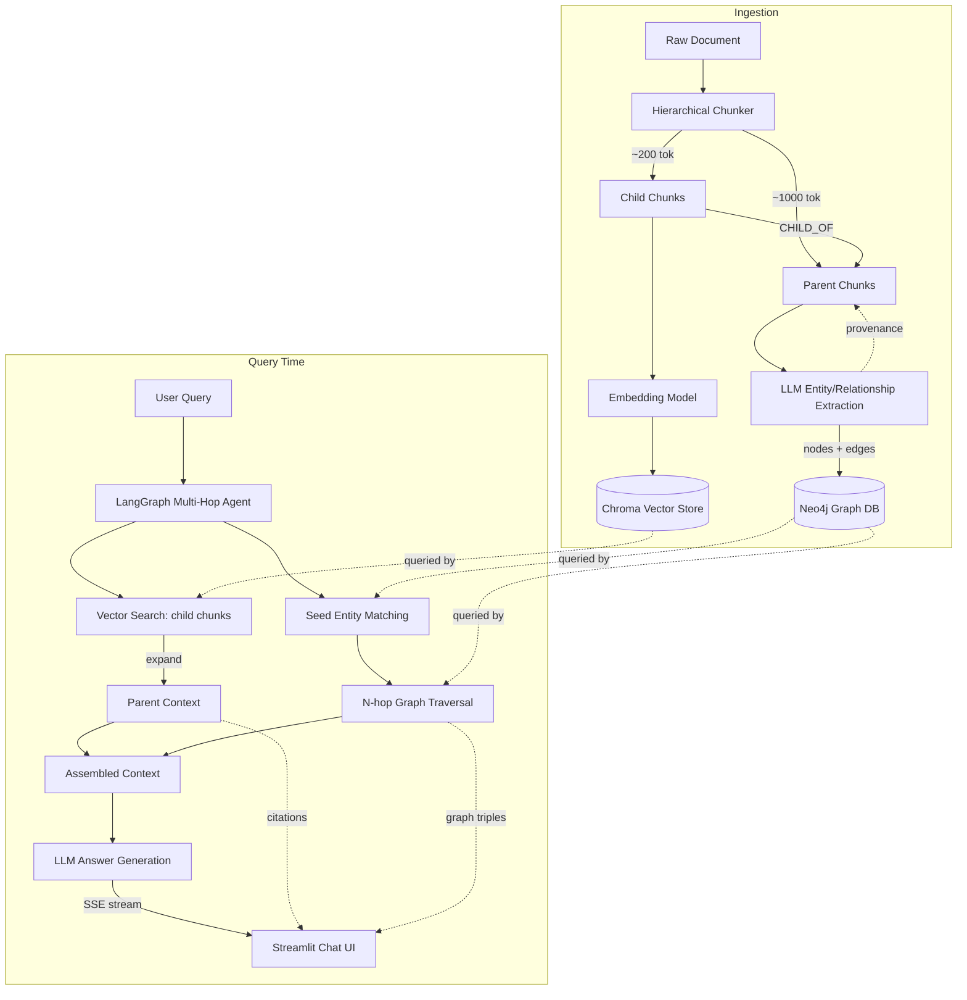

# Full-Stack GraphRAG with Hierarchical Indexing

A production-shaped RAG application combining **parent-child hierarchical
chunking**, an **explicit knowledge graph** (Neo4j) of extracted entities and
typed relationships, a **FastAPI** backend that fuses vector and graph
search through a **LangGraph** multi-hop agent, and a **Streamlit** chat UI
with citation cards and an interactive graph inspector.

## Architecture



### Graph schema (Neo4j)

```
(:Entity {name, type, description})
(:ParentChunk {id, doc_id, order, text})
(:ChildChunk  {id, doc_id, order})

(:ChildChunk)-[:CHILD_OF]->(:ParentChunk)
(:Entity)-[:MENTIONED_IN]->(:ParentChunk)              # provenance
(:Entity)-[:<TYPE> {description, source_chunk}]->(:Entity)  # e.g. ACQUIRED, FOUNDED_BY
```

Relationship types are dynamic LLM output, sanitized into safe Cypher
relationship-type tokens (`app/core/graph_store.py::_sanitize_rel_type`)
before being interpolated into queries — Neo4j does not support
parameterized relationship types, so this is the injection boundary to be
careful with.

### Why a LangGraph agent instead of a single fixed Cypher query

The retrieval agent (`app/agents/graph_rag_agent.py`) is a small state
machine: `retrieve_vector -> seed_graph_entities -> retrieve_graph ->
(conditional: expand another hop | finish)`. If the first-hop subgraph
around the query's seed entities comes back sparse, the agent widens the
traversal radius before handing context to the LLM, up to a configurable
hop budget. This is deliberately simple (not a general ReAct loop) — it's
the smallest state machine that gives genuinely adaptive multi-hop
behavior rather than a hardcoded hop count.

## Repository layout

```
backend/
  app/
    api/            # FastAPI routers: ingest, chat, graph
    agents/         # LangGraph multi-hop retrieval agent
    core/           # chunking, embeddings, vector store, graph store, LLM wrapper
    models/         # Pydantic schemas (shared contracts)
    services/       # RAGService — orchestrates ingest + chat flows
    config.py       # environment-driven settings
    dependencies.py # singleton wiring for FastAPI DI
    main.py         # app entrypoint
  tests/            # pytest suite (mocked external systems, no network needed)
  Dockerfile
  requirements.txt
frontend/
  streamlit_app.py  # chat UI + citations + graph inspector
  Dockerfile
  requirements.txt
docker-compose.yml
.env.example
```

## Setup

### 1. Configure environment

```bash
cp .env.example .env
# edit .env and set OPENAI_API_KEY (required for extraction + generation)
```

`EMBEDDING_PROVIDER=local` (default) uses `sentence-transformers` on-box —
no API key needed for embeddings, only for the extraction/generation LLM
calls. Set it to `openai` to use OpenAI embeddings instead.

### 2. Run everything with Docker Compose

```bash
docker-compose up --build
```

This starts:
- **Neo4j** at `bolt://localhost:7687` (browser UI at `http://localhost:7474`, `neo4j` / `password123`)
- **FastAPI backend** at `http://localhost:8000` (docs at `/docs`)
- **Streamlit frontend** at `http://localhost:8501`

### 3. Run locally without Docker (for development)

```bash
# Backend
cd backend
pip install -r requirements.txt
uvicorn app.main:app --reload

# Frontend (separate terminal)
cd frontend
pip install -r requirements.txt
BACKEND_URL=http://localhost:8000 streamlit run streamlit_app.py
```

You'll need a local or containerized Neo4j instance reachable at the
configured `NEO4J_URI` either way.

### 4. Run tests

```bash
cd backend
pytest -v
```

All external systems (Neo4j, Chroma, OpenAI) are mocked via
`dependency_overrides` / fixtures, so the suite runs offline with no
credentials.

## Sample usage

### Ingest a document

```bash
curl -X POST http://localhost:8000/api/v1/ingest/sync \
  -H "Content-Type: application/json" \
  -d '{
    "doc_id": "acme-2024-10k",
    "text": "In March 2024, Acme Corp acquired Startup Inc for $50M. Jane Doe, Acme'\''s CEO, said the acquisition strengthens Acme'\''s position in the logistics market. Startup Inc was founded in 2019 by John Smith."
  }'
```

Or use the async variant (`POST /api/v1/ingest`) for large documents — poll
`GET /api/v1/ingest/{doc_id}/status` for completion.

### Sample chat queries

```bash
# Streaming (SSE)
curl -N -X POST http://localhost:8000/api/v1/chat \
  -H "Content-Type: application/json" \
  -d '{"query": "Who did Acme Corp acquire and who founded that company?", "stream": true}'

# Non-streaming
curl -X POST http://localhost:8000/api/v1/chat \
  -H "Content-Type: application/json" \
  -d '{"query": "What is Acme'\''s relationship to Startup Inc?", "stream": false}'
```

Other good sample queries to try after ingesting a few related documents:
- *"How is [Entity A] connected to [Entity B]?"* — exercises the multi-hop
  graph traversal directly.
- *"Summarize what happened in Q1 2024."* — exercises vector retrieval +
  parent-context expansion more than the graph.

### Inspect the graph

```bash
curl "http://localhost:8000/api/v1/graph/subgraph?doc_id=acme-2024-10k"
curl "http://localhost:8000/api/v1/graph/subgraph?entity=Acme%20Corp&hops=2"
```

## Design trade-offs: retrieval accuracy vs. latency

- **Parent/child chunk sizes (200 / 1000 tokens).** Smaller child chunks
  improve vector-search precision (less topic dilution per embedding) but
  increase the number of vectors and extraction calls. Larger parent
  chunks give the generation LLM more grounding context per retrieved hit,
  at the cost of feeding it more (sometimes irrelevant) tokens per
  citation — more latency and cost per query. The 200/1000 split is a
  reasonable default; document-heavy domains (legal, financial) may want
  larger parents to preserve clause-level context.

- **Extraction granularity (per parent chunk, not per document).**
  Running extraction on every ~1000-token parent chunk instead of the
  whole document keeps each LLM call's context small (cheaper, more
  reliable structured output) and gives precise provenance (`MENTIONED_IN`
  per chunk). The trade-off is that relationships spanning widely
  separated parts of a long document can be missed unless they're
  re-stated near each other — a known limitation of chunk-local
  extraction, mitigated somewhat by the graph itself accumulating
  cross-document entity co-occurrence over time as more chunks mention
  the same entity.

- **Adaptive multi-hop expansion vs. fixed-depth traversal.** A fixed
  N-hop Cypher query is simpler and has predictable latency, but a query
  that only needs 1 hop pays for N regardless, and a query that genuinely
  needs 3 hops silently returns an incomplete subgraph at N=1. The
  LangGraph agent's conditional expansion (widen only if the current hop
  is sparse) spends the latency budget where it's actually needed, at the
  cost of a slightly less predictable worst-case response time and one
  extra Cypher round-trip when expansion does trigger.

- **Vector + graph fusion happens by concatenation, not re-ranking.**
  Retrieved parent chunks and graph triples are both handed to the
  generation LLM as context and left for the model to reconcile. This is
  simple and fast (no extra re-ranking pass), but a production system at
  scale would likely add a lightweight re-ranker or a relevance-scoring
  step to drop low-value graph triples before they compete for context
  window space against the vector hits.

- **Local vs. OpenAI embeddings.** Local `sentence-transformers` embeddings
  remove a network dependency and per-call cost for the (often much more
  frequent) ingestion path, at some quality cost versus OpenAI's embedding
  models. `EMBEDDING_PROVIDER` is a config flag specifically so this
  trade-off can be revisited per deployment without code changes.

- **SSE over WebSockets.** SSE was chosen for the chat stream because it's
  unidirectional (server → client token stream) and works over plain
  HTTP with simpler infra (no upgrade handshake, easier to put behind
  standard load balancers/proxies). WebSockets would be the better choice
  if the assignment's UI needed bidirectional mid-stream signals (e.g.
  client-side "stop generating"), which isn't required here.

## Known limitations / next steps

- In-memory job status tracking for async ingest (`app/api/ingest.py`)
  should move to Redis or a DB-backed queue (Celery/RQ) for multi-worker
  deployments.
- Entity resolution is exact-name-based (`MERGE (e:Entity {name: ...})`);
  a real deployment would want fuzzy/embedding-based entity resolution to
  merge aliases ("Acme Corp" vs "Acme Corporation").
- No auth/rate-limiting on the API — add before exposing beyond local/dev use.
